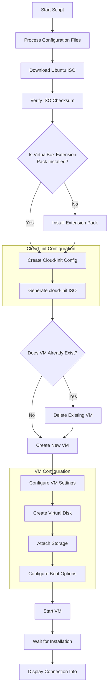

# Touchless! Ubuntu Encrypted VM Setup

This script automates the creation of an Ubuntu 22.04 LTS virtual machine with LUKS disk encryption using VirtualBox. The VM is pre-configured with SSH, X11 forwarding, VNC, and various productivity applications.

## Features

- Automated installation of Ubuntu 22.04 LTS Server with LUKS full disk encryption
- Gnome Desktop Environment
- Remote access via:
  - SSH with X11 forwarding
  - noVNC web interface
- Pre-installed software:
  - GNOME
  - Microsoft Edge
  - Intune Portal
  - 1Password
  - VS Code
- VirtualBox Guest Additions for better integration
- Configurable VM resources (RAM, CPU, disk size)

## Prerequisites

- VirtualBox (with Extension Pack)
- cloud-image-utils package
- Bash environment
- Internet connection

## Quick Start

1. Set your desired configuration using environment variables or use defaults
2. Run the script: `./run.sh`
3. Wait for installation to complete
4. Access your VM through SSH or noVNC

## Workflow

## Configuration Options

| Environment Variable | Default Value | Description |
|---------------------|---------------|-------------|
| VM_NAME | Ubuntu-Encrypted2 | Name of the virtual machine |
| FILE_URL | https://releases.ubuntu.com/jammy/ubuntu-22.04.5-live-server-amd64.iso | URL to download Ubuntu ISO |
| CHECKSUMS | https://releases.ubuntu.com/jammy/SHA256SUMS | URL to download the Ubuntu ISO sha256sum |
| VM_MEMORY | 4096 | RAM in MB |
| VM_CPUS | 2 | Number of CPU cores |
| VM_DISK_SIZE | 25000 | Disk size in MB |
| USERN | ubuntu | Username |
| PASSWORD | ubuntu | Password (also used for disk encryption) |
| HOSTN | ubuntu-encrypted2 | Hostname |

## Connection Details

After installation completes, the script will output connection information:

1. noVNC web interface: `http://<VM_IP>:6080/vnc.html`
2. SSH with X11 forwarding: `ssh -X <USERN>@<VM_IP>`

## Security Notes

- Change the default password after installation
- Consider using an SSH key instead of password authentication
- The encryption password is the same as the user password by default

## Troubleshooting

- If you encounter installation issues, check VirtualBox logs
- For networking problems, verify that the bridged network adapter is properly configured
- If X11 forwarding doesn't work, ensure you have an X server running on your local machine
