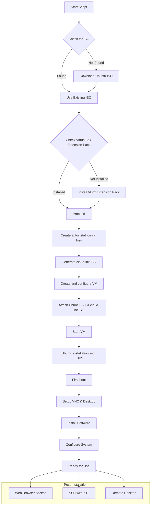

# intune_autoinstall

## Ubuntu LUKS Encrypted VM Setup Script

A bash script for automatically creating and configuring an Ubuntu 24.04 virtual machine with LUKS encryption, VBoxGuestAdditions, Intune, Edge, and VSCode in VirtualBox.

## Workflow Diagram



## Features

- **Full Disk Encryption**: Automatically sets up LUKS encryption during installation
- **Remote Desktop Access**: Configures noVNC for browser-based remote desktop access
- **Automated Installation**: Zero-touch installation of Ubuntu Server
- **Software Suite**: Automatically installs and configures:
  - Microsoft Edge browser
  - Microsoft Intune Portal
  - 1Password CLI
  - Visual Studio Code
  - X11 VNC server
  - NoVNC web client
  - Openbox window manager
- **System Configuration**: 
  - Sets up bridged networking for external access
  - Configures custom hostname based on system UUID
  - Enables SSH server with X11 forwarding
  - Creates graphical desktop environment with application shortcuts

## Requirements

- VirtualBox (with Extension Pack)
- Ubuntu/Debian-based host system
- `cloud-image-utils` package (will be installed if missing)
- Internet connection for downloading ISO and packages

## Usage

1. **Basic usage with default settings**:
   ```bash
   ./run.sh
   ```

2. **Customize with environment variables**:
   ```bash
   VM_NAME="MyUbuntu" VM_MEMORY=8192 VM_CPUS=4 VM_DISK_SIZE=50000 USERNAME="myuser" PASSWORD="mysecret" HOSTNAME="myhost" ./run.sh
   ```

## Configuration Options

| Variable | Description | Default |
|----------|-------------|---------|
| `VM_NAME` | Name of the virtual machine | `Ubuntu-Encrypted` |
| `FILE_URL` | URL for Ubuntu ISO | Ubuntu 24.04.2 URL |
| `VM_MEMORY` | RAM allocated to VM (MB) | `4096` |
| `VM_CPUS` | Number of CPU cores | `2` |
| `VM_DISK_SIZE` | Disk size (MB) | `25000` |
| `USERNAME` | Default user account | `ubuntu` |
| `PASSWORD` | User and encryption password | `ubuntu` |
| `HOSTNAME` | Initial hostname | `ubuntu-encrypted` |

## Post-Installation Access

After installation completes:

1. **Web Browser Access**:
   - Get VM IP address using `ip addr show`
   - Access desktop at: `http://VM-IP-ADDRESS:6080/vnc.html`

2. **SSH with X11 Forwarding**:
   - Connect with: `ssh -X username@VM-IP-ADDRESS`
   - Launch X11 applications directly

3. **VNC Service Management**:
   ```bash
   sudo systemctl restart xvfb.service
   sudo systemctl restart openbox.service 
   sudo systemctl restart x11vnc.service
   sudo systemctl restart novnc.service
   ```

## Troubleshooting

If you have issues with the desktop environment:

1. Check service status:
   ```bash
   systemctl status novnc
   systemctl status xvfb
   systemctl status x11vnc
   systemctl status openbox
   ```

2. Restart all services:
   ```bash
   sudo systemctl restart xvfb openbox x11vnc novnc
   ```

## Notes

- The script creates temporary files that will be cleaned up upon completion
- The seed.iso file must be preserved until installation is complete
- During installation, you'll need to enter the encryption password when prompted
- The hostname will be automatically changed to format: `OXQLNX-{UUID}`
