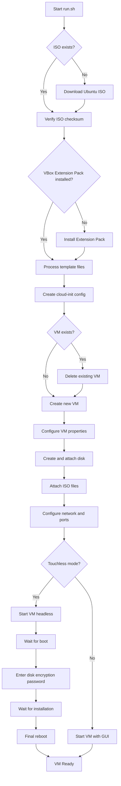

# Touchless! Ubuntu Encrypted VM Deployment

This project automates the creation of an Ubuntu 22.04 virtual machine with full disk encryption in VirtualBox. The VM comes pre-configured with remote access capabilities including SSH with X11 forwarding and a web-based VNC interface.

## Features

- **Automated Installation**: Fully automated or interactive setup options
- **Disk Encryption**: LUKS encryption for the entire disk
- **Remote Access**:
  - SSH with X11 forwarding (port var:SSHPORT)
  - Web-based VNC access (port var:VNCPORT)
  - Virtual framebuffer support (Xvfb)
- **Pre-installed Software**:
  - Microsoft Edge
  - Intune Portal
  - 1Password
  - VS Code
- **VirtualBox Integration**:
  - VirtualBox Guest Additions
  - Shared folders
  - USB 3.0 support

## Requirements

- VirtualBox 6.0 or higher
- Bash shell
- Internet connection (for downloading ISO if not already present)
- At least 25GB of free disk space
- Minimum 4GB RAM available for VM allocation

## Directory Structure

```
.
├── run.sh                      # Main deployment script
├── static
│   └── setup_software.sh       # Script to install additional software
└── templates
    ├── gnome-session-xvfb.service  # Systemd service for Gnome session
    ├── novnc.service               # Systemd service for noVNC
    ├── x11vnc.service              # Systemd service for X11VNC
    └── xvfb.service                # Systemd service for Xvfb
```

## Configuration

The script supports several environment variables to customize your VM deployment:

| Variable       | Default               | Description                               |
|----------------|------------------------|-------------------------------------------|
| VM_NAME        | ubuntu-encrypted2      | Name of the virtual machine               |
| FILE_URL       | Ubuntu 22.04.5 ISO URL | URL to download Ubuntu ISO                |
| VM_MEMORY      | 4096                   | Memory allocation in MB                   |
| VM_CPUS        | 2                      | Number of CPU cores                       |
| VM_DISK_SIZE   | 25000                  | Disk size in MB                           |
| USERN          | ubuntu                 | Username for VM                           |
| PASSWORD       | ubuntu                 | Password for user and disk encryption     |
| TOUCHLESS      | true                   | Fully automated (true) or interactive (false) |

## Usage

### Basic Usage

```bash
./run.sh
```

This will use all default settings to create and configure the VM.

### Custom Configuration

```bash
export VM_NAME="my-secure-vm"
export VM_MEMORY="8192"
export VM_CPUS="4"
export PASSWORD="MySecurePassword"
./run.sh
```

### Interactive Mode

```bash
export TOUCHLESS=false
./run.sh
```

## Workflow



## Access Methods

Once installation is complete, you can access your VM using:

1. **Web Browser**: Visit http://localhost:VNCPORT/vnc.html to access the Gnome desktop
2. **SSH with X11 Forwarding**: Use `ssh -X -p SSHPORT username@localhost`
3. **VirtualBox GUI**: If not using headless mode

## Service Components

### 1. Xvfb (X Virtual Framebuffer)
Creates a virtual X11 display without requiring physical hardware.

### 2. Gnome Session
Provides a full desktop environment within the virtual framebuffer.

### 3. X11VNC
Allows VNC connections to the virtual X display.

### 4. NoVNC
Provides a web-based HTML5 VNC client accessible through a browser.

## Troubleshooting

### Common Issues

1. **Installation hangs at disk encryption prompt**
   - The VM may be waiting for the encryption password input
   - For touchless installations, verify the keyboard input is working

2. **Cannot connect to VNC**
   - Ensure port var:VNCPORT is not blocked by firewall
   - Verify the services are running: `systemctl status novnc.service`

3. **Guest Additions not working**
   - Try reinstalling from VM: `sudo /usr/bin/VBoxLinuxAdditions.run`

### Logs

- Installation logs: Check the generated `install_info.txt` file
- VNC server log: `/var/log/x11vnc.log` in the VM
- System logs: `sudo journalctl -u novnc.service` (or other service names)

## Security Considerations

- Default password should be changed after installation
- Consider restricting access to forwarded ports (SSH/VNC)
- For production use, consider adding firewall rules within the VM

## License

Apache

## Contributing

Contributions are welcome! Please feel free to submit a Pull Request.
