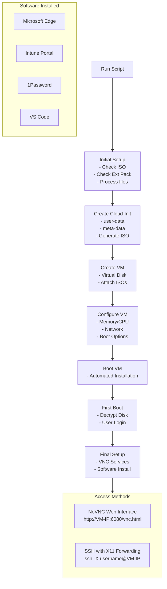

# intune_autoinstall

## Ubuntu LUKS Encrypted VM Setup Script

A bash script for automatically creating and configuring an Ubuntu 24.04 virtual machine in Virtualbox with:
  - LUKS encryption
  - VBoxGuestAdditions
  - Intune
  - Edge
  - VSCode
  - Openbox
  - x11vnc
  - xvfb
  - novnc

Access to the host is provided via ssh, or through a websocket VNC endpoint hosting an xvfb openbox.session.

Relevant installed packages are accessible in the openbox.session via the right mouse button click menu context. 

## MANUAL STEPS

Since we are booting directly from an attached ISO, you need to confirm the autoinstall at the initial launch.
We can mitigate this by using a PXE boot process:
  - Doable via TFP setup (https://www.techrepublic.com/article/enable-pxe-boot-virtualbox/)

After the autoinstall, the box will reboot with disk encryption enabled
  - Input the disk encryption password to continue, and you're good to go.

To access VNC and SSH:
  - Log into the device on the Vbox console
  - Run command: ip -4 addr show | grep -oP '(?<=inet\s)\d+(\.\d+){3}' | grep -v '127.0.0.1' | head -n 1
    - This gives you the bridged IP address of the device
  - VNC: http://ipaddress:6080/vnc.html 
  - SSH: ssh -X username@ipaddress 'command'

## Prerequisites

- Linux host with VirtualBox installed
- `cloud-image-utils` package (will be installed if missing)
- VirtualBox Extension Pack (will be installed if missing)
- Internet connection for downloading ISO and software packages

## Installation

1. Clone this repository:
   ```bash
   git clone https://github.com/yourusername/intune_autoinstall.git
   cd intune_autoinstall
   ```

2. Run the installation script:
   ```bash
   ./run.sh
   ```

## Configuration Options

The following environment variables can be set to customize the installation:

| Variable | Description | Default |
|----------|-------------|---------|
| VM_NAME | Name of the virtual machine | Ubuntu-Encrypted |
| FILE_URL | URL to download Ubuntu ISO | Ubuntu 24.04.2 mirror |
| VM_MEMORY | Memory allocation in MB | 4096 |
| VM_CPUS | Number of CPU cores | 2 |
| VM_DISK_SIZE | Disk size in MB | 25000 |
| USERN | Username for the system | ubuntu |
| PASSWORD | Password for the user (also used for disk encryption) | ubuntu |
| HOSTN | Hostname for the system | ubuntu-encrypted |

Example:
```bash
VM_NAME="MyUbuntuVM" VM_MEMORY=8192 VM_CPUS=4 PASSWORD="secure-password" ./run.sh
```

## Workflow



## Post-Installation

After installation completes, the VM will reboot. You'll need to:

1. Enter the disk encryption password when prompted
2. Once the system has booted, you can access it via:
   - NoVNC web interface: http://VM-IP-ADDRESS:6080/vnc.html
   - SSH with X11 forwarding: `ssh -X ubuntu@VM-IP-ADDRESS`

## Project Structure

- `run.sh` - Main script that orchestrates the VM creation and installation
- `static/` - Static files used in the VM setup
  - `novnc.service` - systemd service for NoVNC
  - `xvfb.service` - systemd service for virtual framebuffer
  - `setup_software.sh` - Script to install additional software
  - `xstartup` - VNC startup configuration
- `templates/` - Template files that will be processed with environment variables
  - `menu.xml` - Openbox menu configuration
  - `openbox.service` - systemd service for Openbox
  - `x11vnc.service` - systemd service for X11VNC
- `tmp/` - Temporary directory for generated files

## Troubleshooting

- If VM creation fails, check the VirtualBox logs in the VM settings
- If installation hangs, try increasing RAM allocation with the VM_MEMORY variable
- For network issues, try switching from bridged to NAT networking by modifying the script

## Security Considerations

- The default password is insecure. Always change it for production use.
- The disk encryption password is stored in cloud-init configuration during setup.
- For production deployments, consider removing the installation traces from the VM after setup.

## License

Apache

## Acknowledgments

- Based on Ubuntu's cloud-init autoinstallation framework
- VirtualBox virtualization platform
